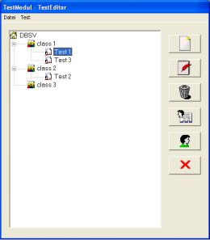



## DBSV TestModul

### Description

Evening Folks, after many years of visiting PSC we want to submit code now too.

Its an application to create, manage and take tests.

You can create tests with various settings, sort the questions, run a simulation of the test, view test results and take it online (meaning using the program).

It includes a readme.txt for starting (since it uses a MySQL database) and the *.pdf manual.

It was part of the LMS module of the DBSV-Project, so you may notice some other "functions" like basic user and role management, creating classes and subjects.

The license checks as well as the encryption have been removed.

This application uses the "Key Login" from Jim K, thanks again for it.

If you feel like you may comment or - if you dare - vote...

This is an updated version, including some changes and you can now use MSSQL too.
 
### More Info
 

             |
---                |---
**Submitted On**   |2012-07-04 16:01:04
**By**             |[Alcazar](https://github.com/Planet-Source-Code/PSCIndex/blob/master/ByAuthor/alcazar.md)
**Level**          |Intermediate
**User Rating**    |4.0 (8 globes from 2 users)
**Compatibility**  |VB 6\.0
**Category**       |[Complete Applications](https://github.com/Planet-Source-Code/PSCIndex/blob/master/ByCategory/complete-applications__1-27.md)
**World**          |[Visual Basic](https://github.com/Planet-Source-Code/PSCIndex/blob/master/ByWorld/visual-basic.md)
**Archive File**   |[DBSV\_TestM222555742012\.zip](https://github.com/Planet-Source-Code/alcazar-dbsv-testmodul__1-74287/archive/master.zip)

